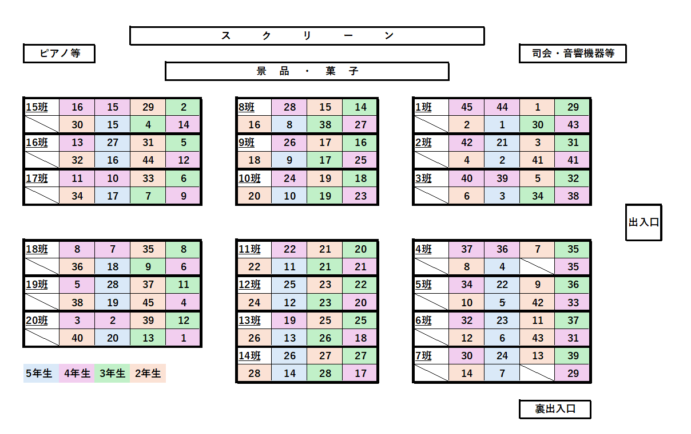

# Iコース学生交流会(2026)

## 概要
このリポジトリはIコース学生交流会(2026)を実施するにあたって，**参加学生の補助となる資料**を置いたものです．
[目次](#目次)より知りたい情報にアクセスしてください．

---

## 目次

### プログラムの説明
- [カードゲーム](./各プログラムの遊び方/カードゲーム.md/)
- [ito](./各プログラムの遊び方/ito.md/)
- [班対抗](./各プログラムの遊び方/班対抗.md/)

### 注意事項
> 今回のお菓子には特定原材料が含まれています．アレルギー等がある方はこちらを参考にしてください．
- [注意事項・アレルギー情報](./注意事項.md)

---

## 当日のプログラム

| # | プログラム | 内容 |
|---|---|---|
| 1 | 自己紹介 | 班のメンバーと自己紹介をしよう |
| 2 | カードゲーム | UNO・音速飯店で班対決 |
| 3 | ito | テーマに沿って数字を当てよう |
| 4 | 班対抗 | スクリーンの指示に従って参加 |

---

## 当日の動き

1. 以下の座席表に従って着席してください．

2. スクリーンの案内に従ってプログラムを進めます．
3. 各プログラムのルールは上記リンクから確認できます．

---

## 会場の約束
- お菓子・飲み物は**こぼさない**ようにしてください
- 包装などのゴミは**ゴミ袋**に入れてください
- 会場設備の破壊・進行の妨害はおやめください